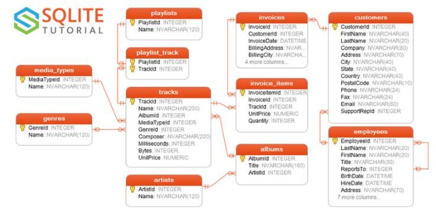

[![Streamlit][framework-shield]][framework-url]
[![Python][python-shield]][python-url]
[![Heroku][heroku-shield]][heroku-url]
[![LinkedIn][linkedin-shield]][linkedin-url]
[![Twitter][twitter-shield]][twitter-url]

# SQLPlayground

## About

A streamlit application to write and execute simple SQL codes.

### Built With

The app is built with [Streamlit][framework-url] framework in [Python][python-url] language. Streamlit is an open-source app framework for Machine Learning and Data Science teams.

## Functionalities

 
### Schema Diagram

 
The following schema is taken from https://www.sqlitetutorial.net/sqlite-sample-database/
This schema is available to write and execute SQL commands.

### SQL code editor
Here the user writes the SQL code to be executed. After the code is entered, "Execute" button is pressed to execute the code. After the code is executed, result can be seen in Display Result section.
 

### Display Result
The resultant rows fetched after the query is executed, can be seen in this section.

<!-- MARKDOWN LINKS & IMAGES -->
<!-- https://www.markdownguide.org/basic-syntax/#reference-style-links -->
[twitter-shield]: https://img.shields.io/twitter/url?style=social&url=https%3A%2F%2Ftwitter.com%2Fsoumya_data
[twitter-url]: https://twitter.com/soumya_data
[framework-shield]: https://img.shields.io/badge/-Streamlit-black?style=plastic&logo=streamlit
[framework-url]: https://streamlit.io/
[heroku-shield]: https://img.shields.io/badge/-Heroku-430098?style=plastic&logo=heroku&logoColor=white
[heroku-url]: https://heroku.com/
[python-shield]: https://img.shields.io/badge/Python-3.6-green?style=plastic&logo=python&logoColor=3776AB&colorA=yellow
[python-url]: https://www.python.org/
[linkedin-shield]: https://img.shields.io/badge/-LinkedIn-0A66C2.svg?style=plastic&logo=linkedin
[linkedin-url]: https://www.linkedin.com/in/soumya-shankar-banerjee/
