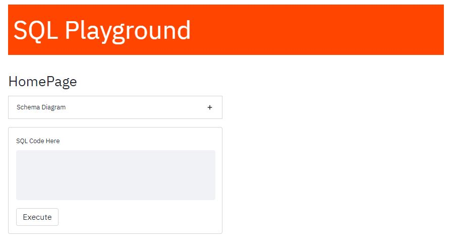
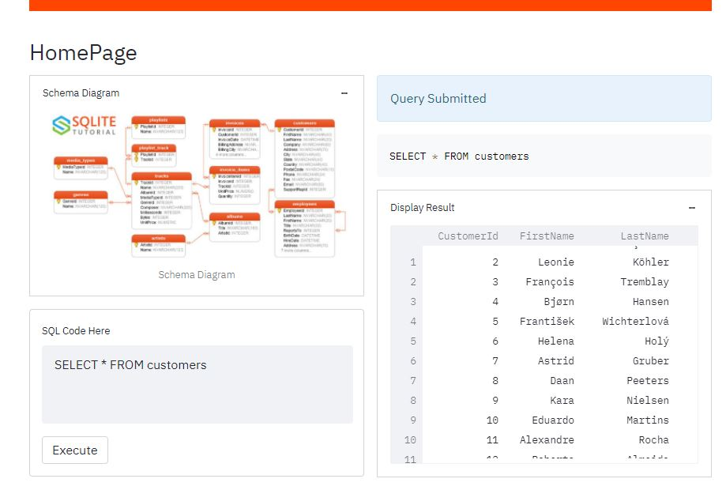

[![Streamlit][framework-shield]][framework-url]
[![Python][python-shield]][python-url]
[![Heroku][heroku-shield]][heroku-url]
[![LinkedIn][linkedin-shield]][linkedin-url]

# SQLPlayground

## About

A streamlit application to write and execute simple SQL codes.

### Built With

The app is built with [Streamlit][framework-url] framework in [Python][python-url] language. Streamlit is an open-source app framework for Machine Learning and Data Science teams.

## Functionalities

 
### Schema Diagram

<!-- MARKDOWN LINKS & IMAGES -->
<!-- https://www.markdownguide.org/basic-syntax/#reference-style-links -->
[framework-shield]: https://img.shields.io/badge/-Streamlit-black?style=plastic&logo=streamlit
[framework-url]: https://streamlit.io/
[heroku-shield]: https://img.shields.io/badge/-Heroku-430098?style=plastic&logo=heroku&logoColor=white
[heroku-url]: https://heroku.com/
[python-shield]: https://img.shields.io/badge/Python-3.6-green?style=plastic&logo=python&logoColor=3776AB&colorA=yellow
[python-url]: https://www.python.org/
[linkedin-shield]: https://img.shields.io/badge/-LinkedIn-0A66C2.svg?style=plastic&logo=linkedin
[linkedin-url]: https://www.linkedin.com/in/soumya-shankar-banerjee/
[app_launch-url]: https://simple-eda.herokuapp.com
[product-screenshot]: images/product_screenshot.jpg
